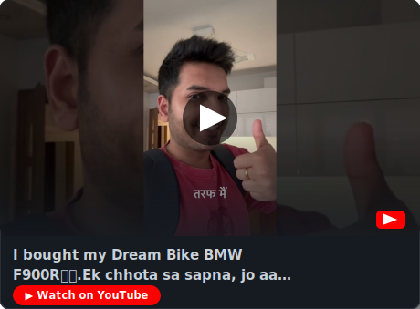
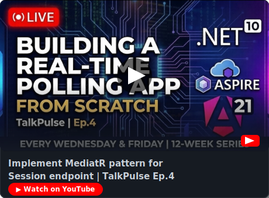
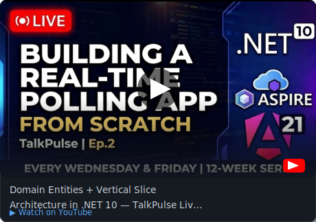
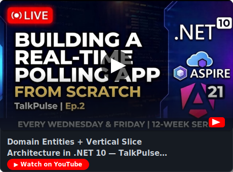

<!-- Header Wave -->


<!-- Typing SVG -->
<p align="center">
  <a href="https://youtube.com/@letsprogram30" target="_blank">
    
  </a>
</p>

<!-- Badges Row -->
<p align="center">
  
  
  <a href="https://twitter.com/yshashi30">
    
  </a>
</p>

<!-- Trophies -->
<p align="center">
  <a href="https://github.com/ryo-ma/github-profile-trophy">
    
  </a>
</p>

---

## 🧑‍💻 About Me

- 🔭 Building full-stack web apps with **Angular, React & .NET**
- 🌱 Currently exploring **GoLang, AI Agents & Cloud Services**
- 🎙️ Organizer of **Angular Sofia Meetup** in Sofia, Bulgaria 🇧🇬
- 📺 Content creator at **[@lets.program](https://instagram.com/lets.program)**
- 💼 Open to **Senior / Lead Frontend or Full-Stack roles**
- 📄 Check out my CV: **[cv.sashikumar.dev](https://cv.sashikumar.dev)**
- 🌐 Portfolio: **[sashikumar.dev](https://sashikumar.dev)**
- ⚡ Night owl coder 🦉 — PUBG is life 🎮

---

## 🛠️ Tech Stack

### Frontend
[](https://skillicons.dev)

### Backend & DevOps
[](https://skillicons.dev)

### Databases & Testing
[](https://skillicons.dev)

---

## 📺 Latest YouTube Videos
<!-- YOUTUBE-VIDEOS-LIST:START -->[Implement MediatR pattern for Session endpoint | TalkPulse Ep.4](https://www.youtube.com/watch?v=Wrjh00os8Fc)[Building Real API Slices With MediatR Pattern in .NET 10 | TalkPulse Ep.3](https://www.youtube.com/watch?v=TPXuxCVZebE)[Domain Entities + Vertical Slice Architecture in .NET 10 — TalkPulse Live Build Ep.2](https://www.youtube.com/watch?v=GBVKKKwdh-w)[Building a Real-Time Live Polling App From Scratch — .NET 10 + Aspire + Angular 21 | TalkPulse Ep.1](https://www.youtube.com/watch?v=1nD8oRCNcPI)[Welcome to the kickoff stream! 🚀](https://www.youtube.com/watch?v=XtfnS_mUv8s)<!-- YOUTUBE-VIDEOS-LIST:END -->

---

---

## 📺 Latest YouTube Videos

<!-- YOUTUBE-CARDS:START -->
<table>
  <tr>
    <td width="50%">
    <a href="https://www.youtube.com/watch?v=Wrjh00os8Fc" target="_blank">
      
    </a>
    </td>
    <td width="50%">
    <a href="https://www.youtube.com/watch?v=TPXuxCVZebE" target="_blank">
      
    </a>
    </td>
  </tr>
  <tr>
    <td width="50%">
    <a href="https://www.youtube.com/watch?v=GBVKKKwdh-w" target="_blank">
      
    </a>
    </td>
    <td width="50%">
    <a href="https://www.youtube.com/watch?v=1nD8oRCNcPI" target="_blank">
      
    </a>
    </td>
  </tr>
</table>
<!-- YOUTUBE-CARDS:END -->

---

## ✍️ Latest Blog Posts
<!-- BLOG-POST-LIST:START -->
<!-- BLOG-POST-LIST:END -->

---

## 📊 GitHub Stats

<p align="center">
  
  
</p>

<p align="center">
  
</p>

---

## 🐍 Contribution Graph

<picture>
  <source media="(prefers-color-scheme: dark)" srcset="https://raw.githubusercontent.com/yshashi/yshashi/output/github-snake-dark.svg" />
  <source media="(prefers-color-scheme: light)" srcset="https://raw.githubusercontent.com/yshashi/yshashi/output/github-snake.svg" />
  
</picture>

---

## ⏱️ This Week I Coded In

<!--START_SECTION:waka-->

```txt
TypeScript   4 hrs 32 mins         ██████████████▒░░░░░░░░░░   57.30 %
Python       48 mins               ██▓░░░░░░░░░░░░░░░░░░░░░░   10.13 %
JSON         41 mins               ██░░░░░░░░░░░░░░░░░░░░░░░   08.66 %
Other        37 mins               ██░░░░░░░░░░░░░░░░░░░░░░░   07.90 %
Bash         21 mins               █░░░░░░░░░░░░░░░░░░░░░░░░   04.48 %
```

<!--END_SECTION:waka-->

---

## 🤝 Connect With Me

<p align="center">
  <a href="https://twitter.com/yshashi30" target="_blank">
    
  </a>
  <a href="https://linkedin.com/in/sashikumar-yadav" target="_blank">
    
  </a>
  <a href="https://instagram.com/lets.program" target="_blank">
    
  </a>
  <a href="mailto:yshashi30@gmail.com">
    
  </a>
  <a href="https://sashikumar.dev" target="_blank">
    
  </a>
</p>

<!-- Footer Wave -->

